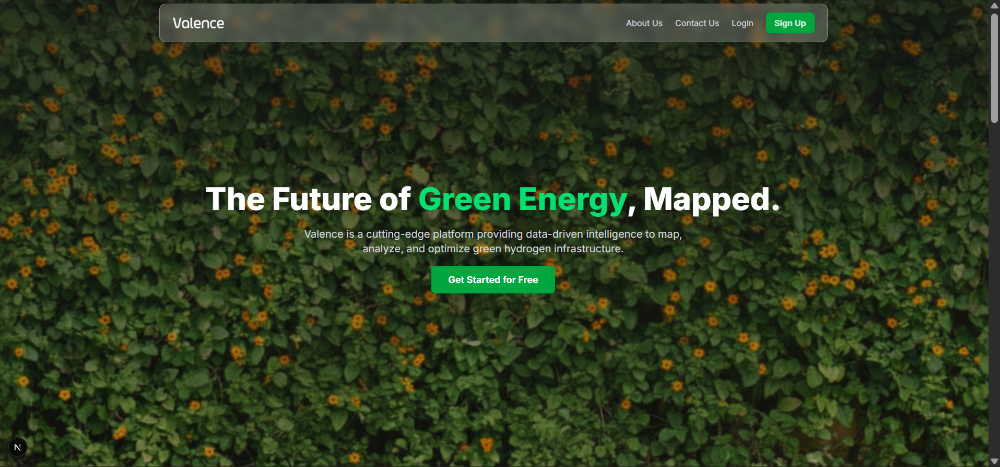
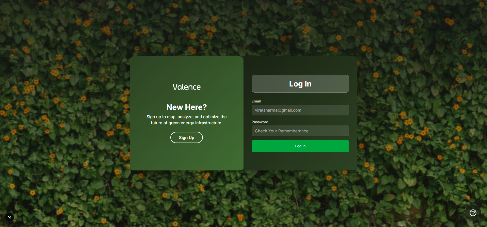
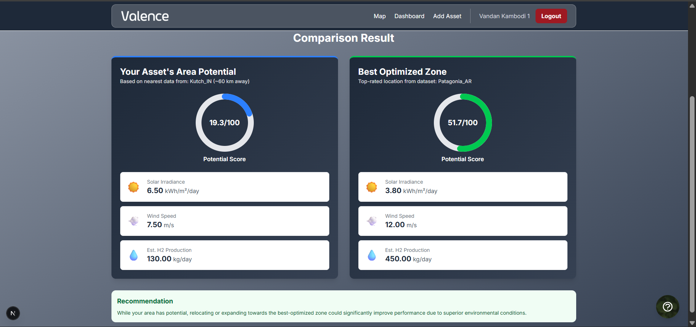
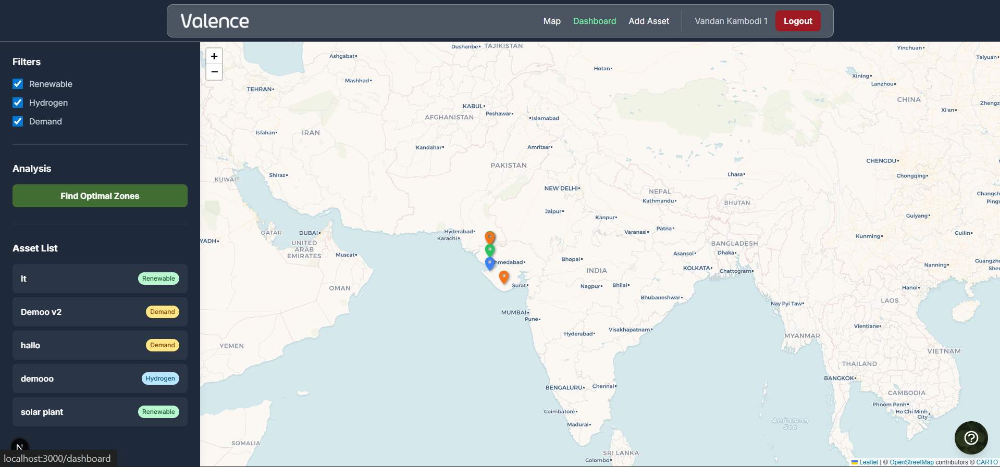
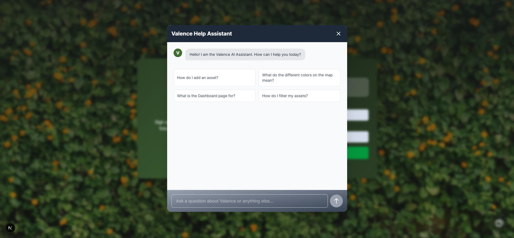

# 🌍 Valence

Valence is a **community-driven platform** designed to connect users with **geospatial data, dashboards, and AI-powered insights** in an intuitive and interactive way. Built with **Next.js, TailwindCSS, Prisma, MongoDB, and NextAuth.js**, the application delivers a seamless and scalable experience for both users and administrators.

<p align="center">
  
  
  
  
  
  
</p>

<p align="center">
  
  
  
  
</p>

---

##  Overview
Valence enables users to:
- 🗺️ View **interactive maps** with geospatial filters.
- 📊 Compare different assets and regions with **dashboards**.
- 🔐 Use secure **authentication flows** (signup/login with JWT).
- 📧 Submit inquiries via **contact forms** integrated with external mail services.
- 🤖 Access **AI assistance** for insights and recommendations.

---

##  Features
- 🔐 **Authentication** with NextAuth.js (Login/Signup)
- 🗺️ **Interactive Maps** with user-specific filters
- 📊 **Dashboards** showing comparisons & insights
- 🤖 **AI Assistant** powered by Google Gemini
- 📧 **Contact Forms** integrated with Resend API
- ⚡ **Modern UI** built with TailwindCSS & shadcn/ui

---

##  Tech Stack
- **Frontend:** Next.js, React, TailwindCSS, shadcn/ui
- **Backend:** Next.js API routes, Node.js
- **Database:** MongoDB with Prisma ORM
- **Auth:** NextAuth.js with JWT
- **AI:** Google Gemini API
- **Mailer:** Resend API

---

## 📂 Project Structure
```bash
valence/
│
├── public/                 # Static assets (favicons, images)
│
├── prisma/                 # Prisma schema & migrations
│   └── schema.prisma
│
├── src/
│   ├── app/                # Next.js App Router (pages)
│   │   ├── api/            # API routes (contact, auth, etc.)
│   │   ├── map/            # Protected map page
│   │   ├── dashboard/      # User dashboard
│   │   ├── auth/           # Authentication pages (login/signup)
│   │   └── page.tsx        # Landing page
│   │
│   ├── components/         # Reusable UI components
│   ├── lib/                # Utility functions (auth, db, helpers)
│   ├── styles/             # Global styles (Tailwind)
│   └── types/              # TypeScript types/interfaces
│
├── .env.local              # Environment variables (not committed)
├── package.json            # Dependencies & scripts
└── README.md               # Project documentation
```

---

##  Installation
1. **Clone the repository**
   ```bash
   git clone https://github.com/vandankambodi/valence.git
   cd valence
   ```

2. **Install dependencies**
   ```bash
   npm install
   ```

3. **Setup Prisma**
   ```bash
   npx prisma generate
   npx prisma db push
   ```

4. **Run the development server**
   ```bash
   npm run dev
   ```
   Visit 👉 [http://localhost:3000](http://localhost:3000)

---

##  Usage
- Visit the landing page.
- Sign up or log in.
- Explore maps & dashboards.
- Use the AI assistant.
- Submit messages via contact form.

---

##  Environment Variables
Create a file named `.env.local` in the root directory:
```env
MONGODB_URI=your_mongodb_atlas_connection_string
NEXTAUTH_SECRET=generate_a_strong_secret_key # You can use an online generator
GEMINI_API_KEY=your_google_gemini_api_key # For the chatbot feature
RESEND_API_KEY=generate_resend_api_key # To get mail of user from contact us page
```

---

##  Screenshots
- **Landing Page**
  

- **Authentication Page**
  

- **Dashboard**
  

- **Map View**
  

- **AI Assistant**
  

---

##  Contributing
Contributions are always welcome!

1. Fork the repo
2. Create a new branch (`git checkout -b feature-name`)
3. Commit changes (`git commit -m 'Add feature'`)
4. Push to your branch (`git push origin feature-name`)
5. Open a Pull Request 🎉

---

##  License
This project is licensed under the **MIT License**.

<p align="center">
  
</p>
